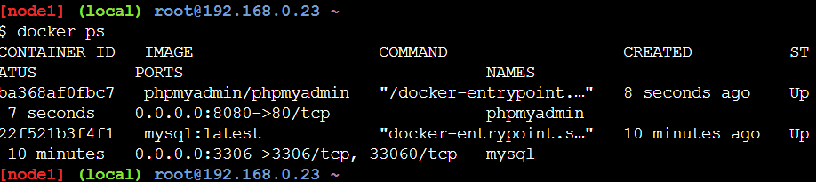

# Practica servidor web
## 1. Titulo
Conexion de Redes de contenedores
## 2. Tiempo de duración
8 horas 
## 3. Fundamentos:
     Redes de contenedores: Las redes de contenedores son sistemas que permiten la comunicación entre contenedores y otros componentes de una infraestructura, tanto en el mismo host como a través de múltiples hosts. Estas redes proporcionan aislamiento, control del tráfico y gestión de la comunicación entre aplicaciones distribuidas (Merkel, 2014).
     
     Puertos: un puerto es un punto virtual de conexión a través del cual se envía o recibe información de un dispositivo de red. Los puertos permiten que múltiples servicios operen simultáneamente en una misma dirección IP sin conflictos (Comer, 2018).
     
     Ip: es un identificador numérico único asignado a cada dispositivo conectado a una red que utiliza el Protocolo de Internet. Sirve para identificar y localizar dispositivos en una red y permitir la comunicación entre ellos (Forouzan, 2017).
     
     Conexion de redes de contenedores:mplica la configuración de entornos de red para contenedores, permitiendo que se comuniquen entre sí o con recursos externos. Esta conexión puede realizarse mediante puentes, redes overlay o drivers personalizados de red, proporcionando flexibilidad y escalabilidad a las aplicaciones (Turnbull, 2014).
  
## 4. Conocimientos previos.
   
Para realizar esta practica el estudiante necesita tener claro los siguientes temas:
- Contenedores.
- Puerto de salida.
- Ip.
- Comandos para creacion de redes de contenedores.

## 5. Objetivos a alcanzar
- Implementar redes de contenedores en Docker para permitir la comunicación entre aplicaciones contenerizadas, comprendiendo los diferentes tipos de redes disponibles.

- Entender el concepto de redes de contenedores.

- Conectar dos contenedore para formar las redes.
## 6. Equipo necesario:
  
- Computador con sistema operativo Windows/Linux
- Plataforma Docker playground

## 7. Material de apoyo.
   
- Documentacion de tendencias tecnologicas.
- Docker playground
- Video ilustrativo
- Documentacion sobre comandos basicos para la creacion de redes de contenedores.
  
## 8. Procedimiento

Paso 1:Crear un contenedor para MySQL, definiendo las credenciales necesarias.  

Paso 2: Verificar lo creado

paso 3: intalar la imagen de phpMyAdmin

paso 4: Crear un contenedor para phpMyAdmin, configurando las credenciales

paso 5: Crear una red personalizada en Docker que permita la comunicación entre ambos contenedores.

paso 6: Conectar ambos contenedores a la red creada.

paso 7: Configurar la conexión entre phpMyAdmin y MySQL.

paso 8:Crear una base de datos de prueba desde la interfaz de phpMyAdmin.

## 9. Resultados esperados:
    
Al finalizar esta practica se pudo evidenciar la importancia de la practica anterior sobre el uso de imagenes, volumenes y creacion de bases de datos, enterder como usar un volumen, crear una red de contenedores y la conexion entre estos.

## 10. Bibliografía
    
Comer, D. E. (2018). Computer networks and internets (6th ed.). Pearson.

Forouzan, B. A. (2017). Data communications and networking (5th ed.). McGraw-Hill Education.

Merkel, D. (2014). Docker: Lightweight Linux containers for consistent development and deployment. Linux Journal, 2014(239), 2.

Turnbull, J. (2014). The Docker book: Containerization is the new virtualization. James Turnbull.

audio:

<audio controls>
  <source src="media/nota.ogg" type="audio/ogg">
 
</audio>
